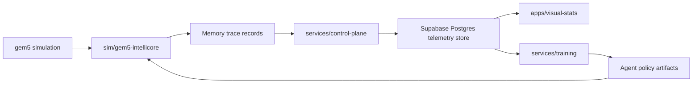

# Data Flow

The scaffold keeps the cycle-accurate simulation boundary separate from Python training. C++ code should emit normalized trace and telemetry events; Python services validate, persist, and replay them.
